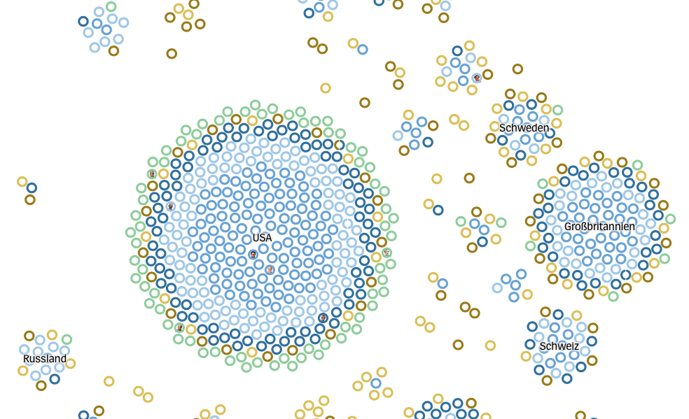

#  Nobel-Laureates

> a DER SPIEGEL scrollytelling



A scrollytelling to highlight all Nobel laureates since 1901. Built with [Svelte](https://svelte.dev) and [D3](https://d3js.org).

Live [here](https://www.spiegel.de/wissenschaft/zirkel-der-genies-a-90c50289-30ac-4a4b-bc49-348676ce6687) (S+) or on your local machine (see below).

`steps.json` contains the configuration of the scrollytelling chapters. `laureates.csv` holds the individual Nobel laureate data from the [The Nobel Foundation](https://www.nobelprize.org/about/developer-zone-2/).

## Run locally

```
git clone https://github.com/spiegelgraphics/nobel-laureates.git
cd nobel-laureates
npm install
npm run dev
```


## Built by

the [DER SPIEGEL](https://www.spiegel.de) graphics department, 2022.

The application was slightly changed compared to its original to be able to run it outside of a dedicated CMS.


## License

Apache License Version 2.0